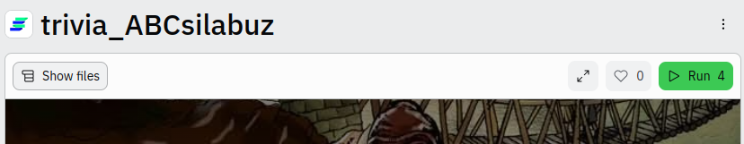

# trivia_ABCsilabuz
Trivia desarrollada en el curso filtro: "ABC de la programación en python" de Silabuz
## Link de Replit
https://replit.com/@JohannCondori/triviaABCsilabuz
### ¿Cómo jugar?
* Abrir el link de ejecución
* Click el botón verde (Run)
  
